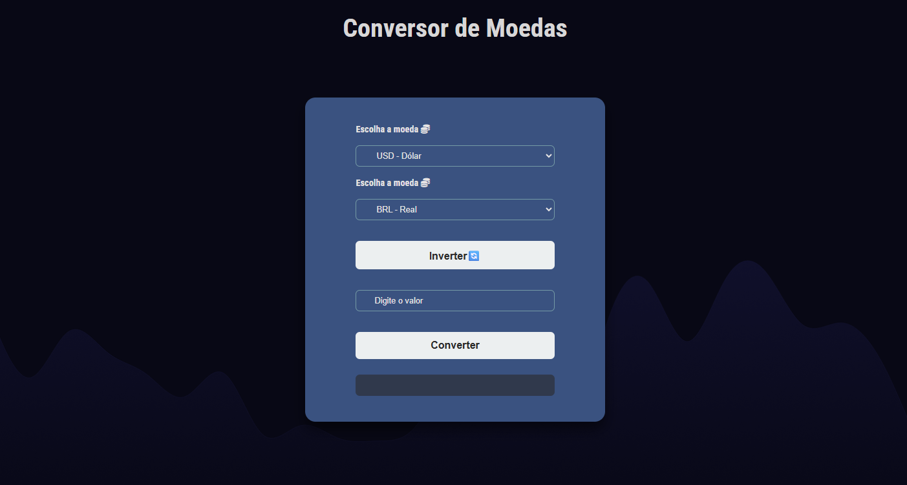

# 💱 Conversor de Moedas

Um conversor de moedas simples e moderno, desenvolvido com **HTML**, **CSS** e **JavaScript puro**. Permite converter entre Dólar (USD), Real (BRL), Euro (EUR) e Libra (GBP) de forma rápida e intuitiva. 

## 🔥 Funcionalidades

- Conversão entre as seguintes moedas:
  - 💵 Dólar (USD)
  - 🇧🇷 Real (BRL)
  - 💶 Euro (EUR)
  - 💷 Libra (GBP)
- Botão para inverter as moedas 🔄
- Design responsivo e compatível com dispositivos móveis
- Ícones visuais com Font Awesome
- Fundo customizado para melhor experiência visual

## 📸 Prévia do Projeto

## 🛠️ Tecnologias Utilizadas

- HTML5
- CSS3
- JavaScript
- [Font Awesome](https://fontawesome.com/)
